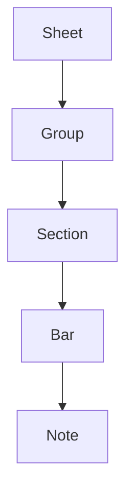

# 🎵 \[Project Name]

**A Domain-Specific Language for Sheet Music**

> A concise description: Describe your language in one sentence.

---

## 🔧 Installation

```bash
# Clone the repo
git clone https://github.com/username/project-name.git
cd project-name

# Build/Install
a npm install -g sheetlang       # if distributed via npm
go install github.com/username/sheetlang@latest   # if Go-based
# or
make install                     # if using Makefile
```

## 🚀 Quick Start


## 🎯 Features


---

## 🖋️ OOP structure


### Sheet

Base class for all S2Y projects
#### attributes
- Title
- Composer
- Rhythm
- Tempo
- Key


### Group
  
Collection of Section class. No attributes

### Section

A fragment of music. Collection of Bar
#### attributes
- Rhythm
- Tempo
- Key

### Bar

Units of section. Collection of Note

#### attributes
- 
---

## Syntax Overview


Within each bar, you can specify up to three element types:

| Element | Syntax                                 |
| ------- | -------------------------------------- |
| `n`     | `n: <pitch>, <duration>[, <prop1>, …]` |
| `c`     | `c: "<chord1> <chord2> …"`             |
| `l`     | `l: "<lyric1> <lyric2> …"`             |

* **Pitch** uses standard notation: letters A–G, with `#` for sharps (e.g. `C#`), `b` for flats (e.g. `Eb`), and `n` for naturals (e.g. `Fn`).
* To write two or more pitches simultaneously (a chord), use + for it.
* **Duration** is a fraction (`1/4`, `1/2`, `1` for a whole note, etc.). The total sum of the duration within a bar should be equal to 1.
* You may list multiple notes (`n:`) per bar, but only one chord line (`c:`) and one lyrics line (`l:`).
* Chords and lyrics align positionally with the notes: items are separated by spaces, and a dash (`-`) marks an empty slot.

For example:

```sheetlang
[
  c: "Cmaj7 - -"
  l: "Do Re Mi"
  n: C, 1/4
  n: D + A, 1/2
  n: E, 1/4
]
```

This defines three notes:

1. **C (¼)** with chord explanation **Cmaj7** and lyric **Do**
2. **D + A (½)** with no chord explanation (`-`) and lyric **Re**
3. **E (¼)** with no chord explanation (`-`) and lyric **Mi**

When rendered, each chord symbol appears above its corresponding note, and each lyric below.

### Note Properties

For each `n:` entry, you can append the following properties:

| Property   | Description                                          |
| ---------- | ---------------------------------------------------- |
| `s`       | Staccato                                             |
| `u(x)`    | Transpose up by *x* semitones                        |
| `o(x)`    | Transpose up by *x* octaves                          |
| `f`       | Fermata                                              |
| `a`       | Accent                                               |
| `d(x)`    | Ornamentation with pitch *x*                         |
| `tr`      | Trill                                                |
| `t`       | Tenuto                                               |
| `m`       | Marcato                                              |
| `dy(x)`   | Dynamic level *x* (e.g., `ff`, `pp`)                 |

### Usage of @
The @ keyword sets the note attribute of the whole section. Note that it works on top of the already passed parameters of the section.

| Property   | Description                                          |
| ---------- | ---------------------------------------------------- |
| `@s`       | Staccato for all notes                                          |
| `@u(x)`    | Transpose up by *x* semitones for all notes                      |
| `@o(x)`    | Transpose up by *x* octaves for all notes                        |
| `@f`       | Fermata for all notes                                             |
| `@a`       | Accent for all notes                                              |
| `@d(x)`    | Ornamentation with pitch *x* for all notes                        |
| `@tr`      | Trill for all notes                                                |
| `@t`       | Tenuto for all notes                                              |
| `@m`       | Marcato for all notes                                             |
| `@dy(x)`   | Dynamic level *x* (e.g., `ff`, `pp`) for all notes                |

## Triplets
Triplets are written by specifying the number of notes you want in it.

**example**

```sheetlang
[
  c: "Cm7 - - "
  (3
  n: C + F, 1/4, u(x)
  n: E3, 1/4, s, d(F3)
  n: R, 1/2
  )
]
```

## 🔄 Loop Structures

Use the `loop` construct to repeat something a fixed number of times. It can repeat a single element, bars, or even a section. The syntax is:

```sheetlang
loop(<count>) { <var> ->
  # inside the block you can write any valid elements
}
```

* `<count>`: number of iterations (repeat times)
* `<var>`: loop variable, starting from `0` to `count - 1`

**Example:** repeat a single quarter-note C four times

```sheetlang
loop(3) { i ->
  [
    n: C, 1/4, u(i)
    n: C, 1/4, u(i)
    n: E, 1/4, u(i)
    n: C, 1/4, u(i)
  ]
}
```

This is equivalent to:

```sheetlang
[
  n: C, 1/4
  n: C, 1/4
  n: E, 1/4
  n: C, 1/4
]
[
  n: D, 1/4
  n: D, 1/4
  n: F#, 1/4
  n: D, 1/4
]
[
  n: E, 1/4
  n: E, 1/4
  n: G#, 1/4
  n: E, 1/4
]
```


## ✨ Articulation & Grouping

### Semicolon (Detach)

Appending a semicolon `;` at the end of an `n:` entry detaches that note from any tie or grouping with the next element. Use it when you want a clear break even if durations would normally connect (e.g., interrupting a tied 1/8 note).

**Syntax**
```sheetlang
n: <pitch>, <duration>;
````

**Example**

```sheetlang
[
  n: F, 1/8;    //eighth note F, detached from the next
  n: F, 1/4
  n: G, 1/4
  n: A, 1/4
  n: E, 1/4
]
```

### Legato (Group)

Wrap notes in parentheses `( … )` to group them into a legato phrase, indicating they should be played smoothly connected.

**Syntax**

```sheetlang
(
  n: <pitch1>, <duration1>
  n: <pitch2>, <duration2>
  …
)
```

**Example**

```sheetlang
[
  (  // legato group
    n: F, 1/4
    n: G, 1/4
    n: A, 1/4
  )
  n: E, 1/4
]
```
## Concatenating Sections
Sections can be concatenated with the '+' symbol. This operation allows two or more sections to be played simultaneously. This could be useful in incorporating harmony to your composition.

**syntax**

```sheetlang
<section1> + <section2>
```

**example**

```sheetlang
s1() + s2()
```

**result**


## 📖 Examples


## 🛣️ Roadmap


---

## 🤝 Contributing


---

## 📜 License

This project is licensed under the [MIT License](LICENSE).

---

> Made with ❤️ by \[Your Name] | Inspired by *그대에게* 🎶
